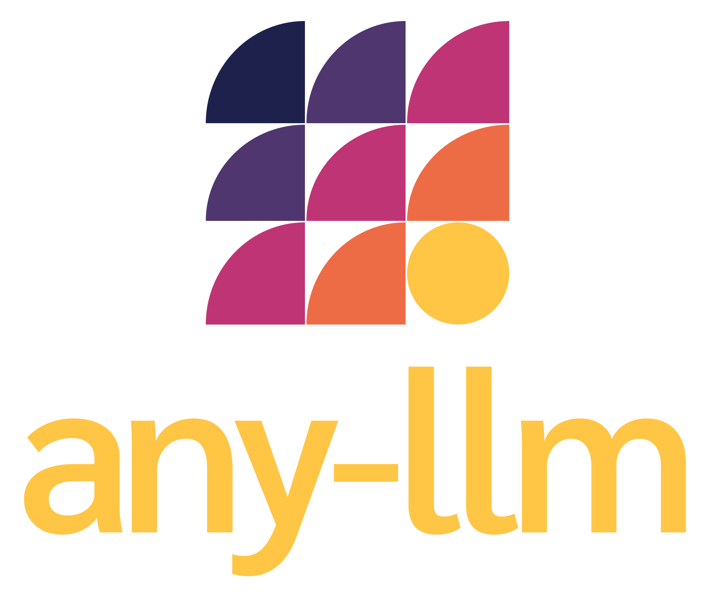

---
schema:
  type: "SoftwareSourceCode"
  name: "any-llm"
  description: "A Python library providing a single interface to different LLM providers including OpenAI, Anthropic, Mistral, and more"
  programmingLanguage: "Python"
  codeRepository: "https://github.com/mozilla-ai/any-llm"
  license: "https://github.com/mozilla-ai/any-llm/blob/main/LICENSE"
---

<p align="center">
  <picture>
    
  </picture>
      <p align="center">  <b>One interface. Every LLM. </b></p>
</p>

`any-llm` is a multi-language, spec-driven library providing a single interface to different llm providers.


=== "Python"

```bash
pip install any-llm-py
```

```python
from any_llm import AnyLLM, Providers
from any_llm.errors import (
  AuthenticationError,
  AnyLLMError,
)
# Directly pass an API key
# Or use environment variables (MISTRAL_API_KEY, ANTHROPIC_API_KEY, etc.)
llm = AnyLLM.create(Providers.MISTRAL)

try:
  response = llm.completion(
      model="mistral-small-latest",
      messages=[{"role": "user", "content": "Hello!"}]
  )
  print(response.choices[0].message.content)
except AuthenticationError as e:
  print(f"Auth failed: {e.message}")
except AnyLLMError as e:
  print(f"Error: {e.message}")
```

=== "Go"

```bash
go get github.com/mozilla-ai/any-llm/go
```

```go
package main

import (
    "fmt"
    "log"
    
    "github.com/mozilla-ai/any-llm/go"
    "github.com/mozilla-ai/any-llm/go/errors"
)

func main() {
    // Directly pass an API key
    // Or use environment variables (MISTRAL_API_KEY, ANTHROPIC_API_KEY, etc.)
    llm, err := anyllm.Create(anyllm.Providers.MISTRAL)
    if err != nil {
        log.Fatal(err)
    }

    response, err := llm.Completion(anyllm.CompletionParams{
        Model: "mistral-small-latest",
        Messages: []anyllm.Message{
            {Role: "user", Content: "Hello!"},
        },
    })
    
    if err != nil {
        switch e := err.(type) {
        case *errors.AuthenticationError:
            fmt.Printf("Auth failed: %s\n", e.Message)
        case *errors.AnyLLMError:
            fmt.Printf("Error: %s\n", e.Message)
        default:
            log.Fatal(err)
        }
        return
    }

    fmt.Println(response.Choices[0].Message.Content)
}
```

=== "TypeScript"

```bash
npm install any-llm-ts
```

```typescript
import { AnyLLM, Providers } from "any-llm";
import { AuthenticationError, AnyLLMError } from "any-llm/errors";

// Directly pass an API key
// Or use environment variables (MISTRAL_API_KEY, ANTHROPIC_API_KEY, etc.)
const llm = await AnyLLM.create(Providers.MISTRAL);

try {
  const response = await llm.completion({
    model: "mistral-small-latest",
    messages: [{ role: "user", content: "Hello!" }],
  });

  console.log(response.choices[0].message.content);
} catch (e) {
  if (e instanceof AuthenticationError) {
    console.log(`Auth failed: ${e.message}`);
  } else if (e instanceof AnyLLMError) {
    console.log(`Error: ${e.message}`);
  }
}
```

=== "Rust"

```bash
cargo add any-llm-rs
```

```rust
use any_llm::{AnyLLM, Providers, Message};
use any_llm::errors::{AuthenticationError, AnyLLMError};

#[tokio::main]
async fn main() {
    // Directly pass an API key
    // Or use environment variables (MISTRAL_API_KEY, ANTHROPIC_API_KEY, etc.)
    let llm = AnyLLM::create(Providers::MISTRAL).await
        .expect("Failed to create LLM client");

    let response = llm.completion(
        "mistral-small-latest",
        vec![Message {
            role: "user".to_string(),
            content: "Hello!".to_string(),
        }]
    ).await;

    match response {
        Ok(resp) => println!("{}", resp.choices[0].message.content),
        Err(AnyLLMError::Authentication(auth_err)) => {
            println!("Auth failed: {}", auth_err.message);
        }
        Err(e) => {
            println!("Error: {}", e);
        }
    }
}
```